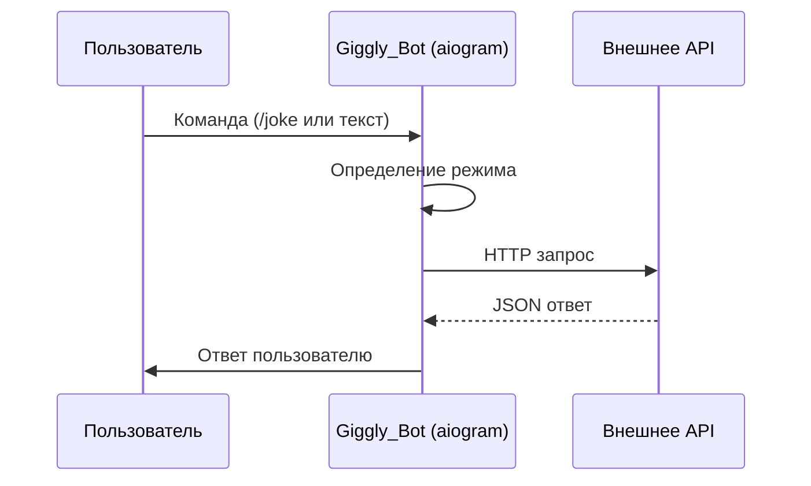

# 🤖 Giggly_Bot — Многофункциональный юмористический Telegram-бот

**Giggly_Bot** — это асинхронный Telegram-бот, разработанный в рамках лабораторной работы по дисциплине «Языки программирования». Бот предназначен для поднятия настроения пользователям через генерацию шуток, получение мемов и интеллектуальное общение с использованием нейросетей.

## 🌟 Основные возможности
* **Случайные шутки**: Интеграция с внешними API для получения свежего юмора на русском и английском языках.
* **ИИ-генератор (Llama 3)**: Генерация оригинальных шуток на любую тему, заданную пользователем.
* **Умный чат**: Режим общения с остроумным ИИ-помощником.
* **Мемы**: Загрузка случайных изображений-мемов с популярных сабреддитов через API.
* **Мультиязычность**: Полная поддержка русского и английского интерфейсов.

## 🛠 Технологический стек
Проект реализован на языке **Python 3.10+** с использованием следующих технологий:

* **aiogram 3.x** — асинхронный фреймворк для Telegram Bot API
* **aiohttp** — неблокирующие HTTP-запросы
* **Groq SDK** — работа с LLM (Llama 3)
* **python-dotenv** — управление конфигурацией
* **Official Joke API & Meme API** — внешние источники данных

## 🚀 Установка и запуск

### 1. Клонирование репозитория
```bash
git clone https://github.com/твоё_имя/giggly-bot.git
cd giggly-bot
```

### 2. Виртуальное окружение
```bash
python -m venv venv
source venv/bin/activate  # Linux/macOS
# или
venv\\Scripts\\activate  # Windows
```

### 3. Установка зависимостей
```bash
pip install -r requirements.txt
```

### 4. Конфигурация (.env)
```env
BOT_TOKEN=ваш_токен
GROQ_API_KEY=ваш_ключ
```

### 5. Запуск
```bash
python main1.py
```

## 📋 Команды
* `/start` — запуск и выбор языка
* `/help` — справка
* `/joke` — случайная шутка

## 🧠 Архитектура



## 📌 Примечания
* Все запросы выполняются асинхронно
* Поддерживается высокая нагрузка
* Легко расширяется новыми функциями

## 📄 Лицензия
MIT License

